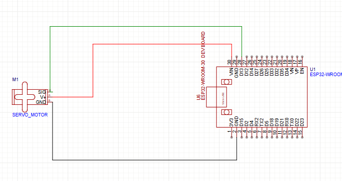

# 🔐 Déploiement du Projet AirlockUnlock

## 🗂 Sommaire

- [🧠 Description des dossiers](#-description-des-dossiers)
- [🚀 Étapes de déploiement](#-étapes-de-déploiement)
  - [1. Clonage du projet](#1-clonage-du-projet)
  - [2. Lancement des services avec Docker](#2-lancement-des-services-avec-docker)
  - [3. Accès à l’interface Web](#3-accès-à-linterface-web)
  - [4. Connexion et configuration de l’ESP32](#4-connexion-et-configuration-de-lesp32)
  - [5. Installation et configuration de l’application mobile](#5-installation-et-configuration-de-lapplication-mobile)
  - [6. Stopper et sauvegarder les services](#6-stopper-et-sauvegarder-les-services)

---

## 🧠 Description des dossiers

### 🔧 `APIs/`
- Contient les services backend en PHP.
- S’appuie sur Docker (MySQL, phpMyAdmin, Nginx...).
- Authentification, gestion des utilisateurs, réservation, etc.

### 📱 `AppMobile/`
- Application Android (fichier `.apk`).
- Permet à un utilisateur de réserver, déverrouiller une serrure, etc.
- ⚙️ Configuration manuelle de l’API et de l’ESP32 directement dans l’appli.

### 📡 `IoT/`
- Code Arduino pour la carte ESP32.
- ⚠️ Le Wi-Fi (SSID/mot de passe) est à personnaliser selon le point d’accès utilisé.
- Permet de piloter la serrure connectée.

### 🌐 `Web/`
- Interface Web de gestion.
- Basée sur React (contenu dynamique, visualisation des réservations, etc.).
- S’interface avec la même API que l'application mobile.

---

## 🚀 Étapes de déploiement

### 1. Clonage du projet

Clonez la branche `Deploiement` depuis GitHub :

```bash
git clone -b Deploiement https://github.com/JR-CIEL-2-PROJETS/25-airlocunlock.git
cd 25-airlocunlock
```

---

### 2. Lancement des services avec Docker

Veillez a avoir installez les dépendances Docker & Docker-compose
Dans la racine du projet, exécutez la commande suivante :

```bash
./docker-up.sh
```

Ce script va :
- Détecter automatiquement l’adresse IP locale (pour l’API et le Web).
- Démarrer les services suivants : **PHP API**, **MySQL**, **phpMyAdmin**, **Nginx**, **Interface Web React**.
- Importer automatiquement les bases de données : `airlockunlock` et `tapkey`.

⚠️ Si vous rencontrez un problème de permission pour exécuter le script :

```bash
chmod +x docker-up.sh
```
---

### 3. Accès à l’interface Web

Pour accéder au site Web, ouvrez votre navigateur et entrez l’URL :

```
https://{adresse-IP-de-votre-PC}:422
```

#### 🔍 Comment récupérer votre adresse IP locale :
- Sur **Linux** :  
  ```bash
  hostname -I
  ```
- Sur **Windows** :  
  ```bash
  ipconfig
  ```

---

### 4. Connexion et configuration de l’ESP32

#### 🧷 Schéma de branchement

📌 Branchez l’ESP32 à la serrure selon le schéma suivant :  
📸 *()*

#### 🛠 Étapes dans l’IDE Arduino

1. Ouvrez **Arduino**.
2. Ouvrez le fichier dans le dossier `IoT/`.
3. Modifiez les identifiants Wi-Fi :

```cpp
const char* ssid = "NomDuReseau";
const char* password = "MotDePasse";
```

4. Activez le **point d’accès mobile** de votre PC (hotspot).
5. **Ouvre l’IDE Arduino**
Ajoute cette URL dans "URL de gestionnaire de cartes supplémentaires" :

```bash
https://raw.githubusercontent.com/espressif/arduino-esp32/gh-pages/package_esp32_index.json
```
Va dans Outils > Type de carte > Gestionnaire de cartes
**Installe esp32 by Espressif Systems**

Sélectionne ta carte ESP32 :
**Outils > Type de carte > ESP32 Dev Module (ou autre modèle ESP32)**

Aller dans le Gestionnaire de bibliothèques
**Clique sur Croquis > Inclure une bibliothèque > Gérer les bibliothèques...**

Rechercher **ESP32Servo**
Dans la barre de recherche, tape : ESP32Servo

Installer la bibliothèque
Trouve ESP32Servo (par Kevin Harrington) et clique sur Installer.

6. Téléversez le code sur la carte ESP32.
7. Dans le **Moniteur série**, récupérez l’adresse IP attribuée à l’ESP32.

---

### 5. Installation et configuration de l’application mobile

#### 📲 Étapes :

1. Depuis un smartphone Android, téléchargez l’APK ici :  
   📦 [Lien de téléchargement de l’application](https://github.com/JR-CIEL-2-PROJETS/25-airlocunlock/releases/download/V1/AirlockUnlock.apk)*

2. Installez l'application.
3. Connectez le smartphone au **point d’accès Wi-Fi du PC**.
4. Ouvrez l'application et cliquez **3 fois sur l’icône engrenage** en bas à droite.
5. Renseignez les champs :
   - **Adresse IP de l’API** : Adresse IP du PC (vue à l’étape 3)
   - **Port de l’API** : `421`
   - **Adresse IP de l’ESP32** : Vue dans le moniteur série Arduino

✅ Vous êtes prêt à utiliser **AirlockUnlock** !

---

## ✅ Le système est prêt

Vous avez maintenant :
- ✅ Le backend déployé
- ✅ L’interface Web en HTTPS
- ✅ L’application mobile fonctionnelle
- ✅ La serrure connectée prête via ESP32

---

### 6. Stopper et sauvegarder les services

Pour arrêter tous les services et sauvegarder les bases de données :

```bash
./docker-down.sh
```

Ce script :
- Arrête tous les conteneurs Docker
- Sauvegarde les BDD dans :
  - `APIs/code/back_airlockunlock.sql`
  - `APIs/code/back_tapkey.sql`

---


